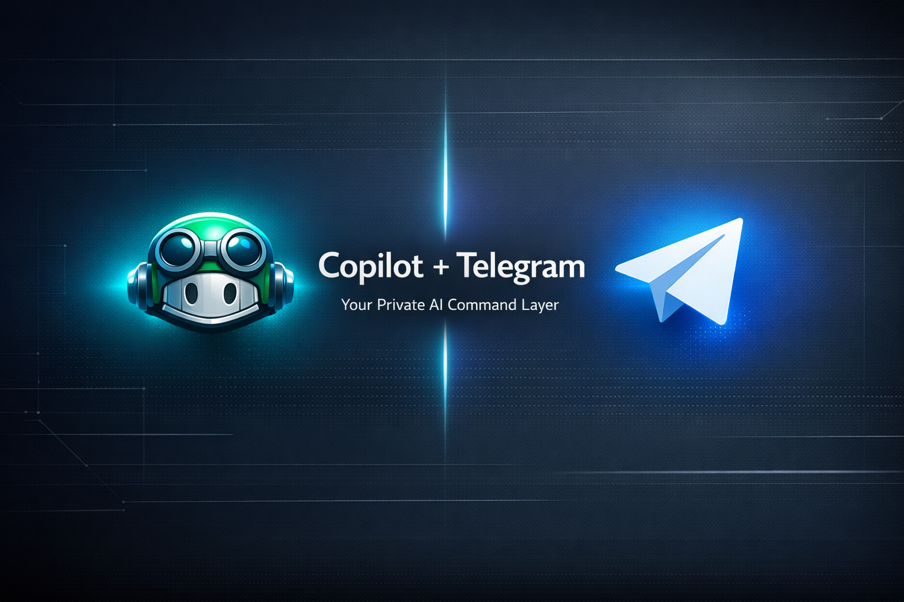

# Copilot Bridge



<!-- LONG FORM README: This file is intentionally detailed for public consumption. -->

## Overview

Copilot Bridge is a compact Telegram bridge that lets you interact with a Copilot-like CLI or AI service from Telegram. It provides file browsing, command execution, and model selection features, and is designed to be run on a personal server or VPS. This repository intentionally keeps secrets out of version control; populate a local `.env` following `.env.example`.

## Features

- Telegram bot interface with owner-only controls
- Browse server filesystem and send files back to Telegram
- Execute shell commands remotely (owner-only)
- Model discovery and switching
- Interactive UIs with buttons / inline keyboards
- Pluggable environment via `.env` or CLI overrides

## Quickstart (Local)

1. Create a Python virtual environment and install dependencies:

```bash
python -m venv .venv
source .venv/bin/activate  # Windows: .venv\Scripts\activate
pip install -r requirements.txt
```

2. Copy `.env.example` to `.env` and fill in `TELEGRAM_TOKEN` and `OWNER_ID`.

3. Run the bot:

```bash
python bot.py
```

Or use CLI overrides:

```bash
python bot.py --telegram-token "<token>"
```

## Deployment (VPS)

Recommended layout:

- Place project under `/opt/copilot-bridge`
- Create a systemd unit to run the bot as a service
- Ensure `.env` is present and private (not committed)

Example systemd unit:

```ini
[Unit]
Description=Copilot Bridge Telegram Bot
After=network.target

[Service]
User=root
WorkingDirectory=/opt/copilot-bridge
EnvironmentFile=/opt/copilot-bridge/.env
ExecStart=/opt/copilot-bridge/.venv/bin/python bot.py
Restart=always

[Install]
WantedBy=multi-user.target
```

## Configuration

Configuration values can be set via a local `.env` file or via CLI arguments. The `.env` file is ignored by Git (see `.gitignore`). Do not commit your `.env`.

Key variables:

- `TELEGRAM_TOKEN` — token for your Telegram bot
- `OWNER_ID` — numeric Telegram ID of the bot owner
- `COPILOT_MODE` — runtime behavior (ask/suggest/explain)

## Security

- Secrets must never be committed. The project includes `.env.example` and `.gitignore` to help. If you accidentally committed secrets, rotate them immediately.
- Limit bot access by setting `OWNER_ID` and checking membership before executing sensitive commands.

## Development Notes

- The bot uses inline keyboards and callback query handlers for interactive flows (file browsing, delete confirmations, model pickers).
- The code is intentionally simple so you can adapt the command execution and file access behavior to your environment.

## Contributing

Contributions are welcome. Open an issue or PR with a clear description. Avoid changing secret-handling logic that would risk exposing tokens in history.

## License

MIT

---

If you'd like a personalized README copy with screenshots, CLI examples, or a Dockerfile, I can add that next.

Copilot Bridge is a personal Telegram bot that forwards your messages to the GitHub Copilot CLI on the server and returns the result back to Telegram. It also includes file browsing, file sending, media analysis, timeout continuation, and owner-only controls.

## Requirements

Before you run it, make sure these are already installed and authenticated on the machine:

- [GitHub CLI](https://cli.github.com/)
- [Copilot CLI](https://docs.github.com/copilot/using-github-copilot/using-github-copilot-cli)
- A Telegram bot token from BotFather
- A Telegram numeric owner ID

You should already be logged in to GitHub with `gh auth status`, and Copilot CLI should already be logged in on the server.

## Quick Start

```bash
cp .env.example .env
```

Fill in the values in `.env`, or pass them from the command line when starting the bot.

## CLI token setup methods

You can provide the Telegram token in any of these ways:

### 1. Environment file

```bash
cp .env.example .env
# edit .env and set TELEGRAM_TOKEN and OWNER_ID
python bot.py
```

### 2. Shell environment variables

**PowerShell**

```powershell
$env:TELEGRAM_TOKEN="123456:ABC..."
$env:OWNER_ID="123456789"
python bot.py
```

**macOS/Linux**

```bash
export TELEGRAM_TOKEN="123456:ABC..."
export OWNER_ID="123456789"
python bot.py
```

### 3. Command-line arguments

```bash
python bot.py --telegram-token "123456:ABC..." --owner-id 123456789
```

You can also override other runtime values:

```bash
python bot.py --telegram-token "123456:ABC..." --owner-id 123456789 --copilot-mode ask --cli-timeout 180
```

## What the bot does

- Sends your prompts to Copilot CLI
- Lets you browse files on the server
- Sends files back to Telegram
- Stores the last selected file for quick reuse
- Works in owner-only mode
- Can analyze images, audio, video, and documents when tools are available

## Public repo notes

This repository is intended to stay secret-safe:

- `.env` is ignored by git
- `bot.py` supports CLI overrides so you do not need to hardcode tokens
- Use `.env.example` as the template for your own deployment

## Service example

If you run this on Linux as a service, the unit should point to the Python interpreter you want to use:

```ini
[Service]
Type=simple
User=root
WorkingDirectory=/opt/copilot-bridge
ExecStart=/usr/bin/python3 /opt/copilot-bridge/bot.py
Restart=always
RestartSec=3
Environment=PYTHONUNBUFFERED=1
```

## GitHub repo guidance

If you are publishing this on GitHub, create the repository as private if it contains personal workflow details or tokens, then remove secrets from the tracked files and keep only `.env.example` in the repo.
